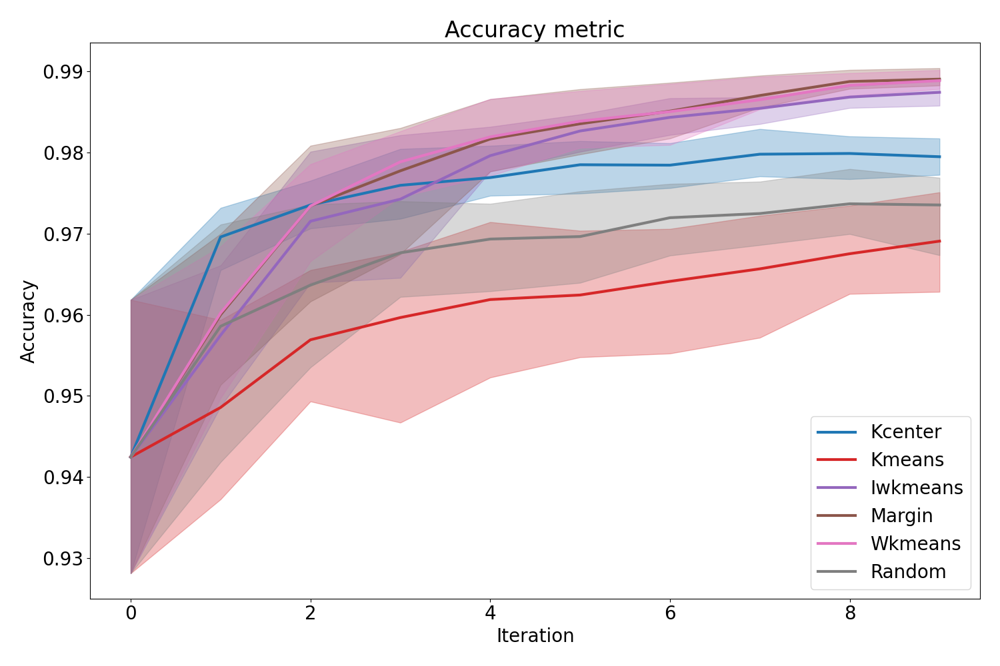
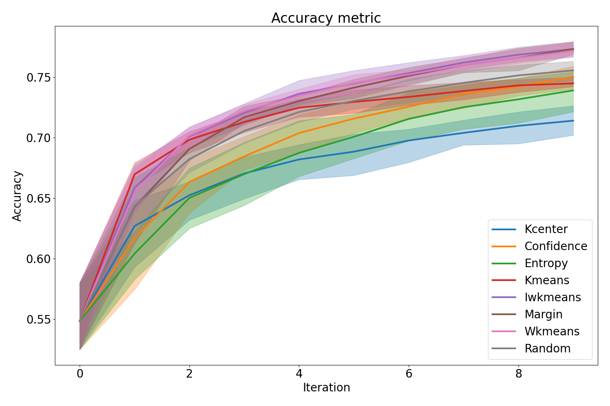

=======
Results
=======

Some results from the benchmark

Tabular data
============

Run_or_walk_information dataset (dataset id n°40922)
----------------------------------------------------

.. _ma_figure:      
.. Figure name (not mandatory)

   Run_or_walk_information accuracy results

.. 

road-safety dataset (dataset id n°42803)
----------------------------------------

.. figure:: ../experiment_results/42803/plots/plot-Accuracy.png
   :align: center

   road-safety accuracy results

.. 

Image data
==========

MNIST dataset
-------------

.. figure:: ../experiment_results/mnist/plots/plot-Accuracy.png
   :align: center

   MNIST accuracy results
..     :height: 100
   :scale: 40
..     :width: 200
..     :alt: ordinateur         .. Alternative text for an unloaded image 
.. 

CIFAR10 dataset
---------------

   CIFAR10 accuracy results

.. 
